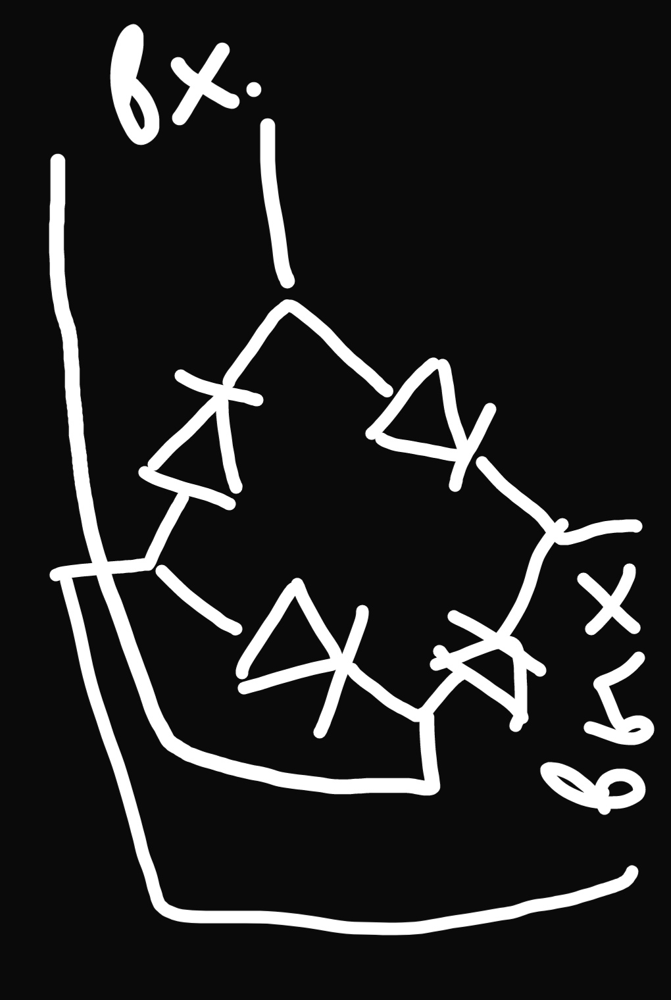

## Опрос практика 1
1. Работали ли вы с чем-то из перечисленного? 
- Linux, как юзер и разработчик (недавно ради общего развития начал изучать бэкенд и Go) 
- Git, пользуюсь на работе в связке с GitLab. Учусь работать с ним из командной строки
- МК AVR, STM32, GD32, AT32, ESP32. 
- - AVR - прогал на парах в бакалавриате, через регистры в Atmel Studio. 
- - STM32 - писал небольшие проекты для себя на blue pill'е и discovery, стажировался во ВНИИА им. Духова в отделе АСУ ТП (но там не так много кода написал в итоге). 
- - GD32 - стажировался уже в другом отделе)) там написал код для управления и простенькой отладки платы через терминал по UART. 
- - AT32 - написал драйвер для протокола SGPIO, и еще парочку маленьких драйверов. 
- - ESP32 - немного работал в небольшой компании, производящей умные краны для офиса, писал код для некоторых модулей, писал прошивку для испытательного стенда. 
- Arduino - прогаю со школы, все свои заказы на фрилансе делал на Arduino... все мы грешны
- ST Nucleo - на парах Воскова, Discovery - моя первая отладочная STM32 (F0xx) 
- Немного работал с FreeRTOS под ESP32. Создал несколько своих тасков
- Raspberry Pi. Был заказ на фрилансе - сделать умную кофемашину, которой можно будет управлять через ПО заказчика (какой-то агент для серверов, честно говоря, я до сих пор не понял...). Решили взять малинку (Zero 2W 4GB) и поставить на нее Ubuntu. Написал буквально два скрипта для управления GPIO (вкл/выкл кофемашины, подача кофе) и общения по UART с ардуинкой, отвечающей за подсветку логотипа компании (лента ws2812). 
2. Что означает ключевое слово volatile в языке С? 
- переменная, объявленная с модификатором volatile, может быть изменена не предусмотренным в программе способом
3. Для чего в С может быть использовано ключевое слово static? 
- для скрытия переменных/функций внутри зоны видимости файла (псевдо инкапсуляция) 
- для объявления переменных внутри функций до входа в тело функции (переменная будет определена на стеке) + сохранит свое значение между вызовами функций
4. Что означает в Си ключевое слово auto? А в Си++? Можно ли, используя это свойство, написать программу, которая компилировалась бы и как программа на Си, и как программа на Си++, но при этом выдавала бы разные результаты в зависимости от языка? 
- В С используется для создания переменных, существующих только внутри определенного куска кода. 
- В С++ используется для автоопределения типа переменной
5. Какое максимальное значение может быть записано в переменную типа int? char? uint16_t? 
- int хранит положительные и отрицательные целочисленные значения, размер зависит от длины слова системы. Если процессор 32-битный, то занимает 4 байта, max(int) = 2^32^/2 - 1 = 2 147 483 647
- char хранит один код символа по таблице ASCII, выделяется 1 байт (8 бит), max(char) = 2^8^/2 - 1 = 127
- uint16_t это unsigned int, на который выделяется 16 бит, max(uint16_t) = 2^16^ - 1 = 65535
6. Определите переменную a, типом которой является
- Целое число
```C
int a;
```
- Указатель на целое число
```C
int *a;
```
- Массив из 10 целых чисел
```C
int a[10];
```
- Массив из 10 указателей на целое число
```C
int *a[10];
```
- Указатель на массив из 10 чисел
```C
int (*a)[10];
```
- Указатель на функцию, принимающую в качестве аргумента целое число и возвращающую целое число
```C
int (*a)(int);
```
- Массив из 10 указателей на функции из предыдущего пункта
```C
int (*a[10])(int);
```
7. Что выведет этот фрагмент кода, и почему?
- Выведет **Got a valid pointer**. Мы запросили от функции malloc указатель на область памяти, равной 0 байт. Функция не проверяет это условие и выделит такую область (по крайней мере в исходниках той реализации, которые я смотрел) и спокойно вернёт указатель. 
8. Никуда не подглядывая, изобразите диодный мост.
 
9. Микроконтроллер имеет напряжение питания 3,3 В, а работающее с ним периферийное устройство - 5 В (и соответствующие логические уровни). Каким способом лучше всего подключить их друг к другу и почему? 
- Преобразователь уровней
- Можно сделать простенький конвертер из резисторов - сделать делитель напряжения, взять три 1кОм резистора, соединить их последовательно, и снять с двух напряжение 2/3 * 5 = 3.35 В
10. Что происходит в этом видео?
- По входу питания ноутбука стоит фильтр - Х-конденсаторы, они подключены одной ногой к фазе и нулю, другой оба к корпусу. Получается делитель переменного напряжения. Обычно Х-конденсаторы одинакового номинала, поэтому делится пополам - 110 В, но ничто не идеально, и кондёры могут иметь немного разные номиналы, отсюда 104-105 В на видео. Чтобы это исправить, нужно подключать БП к розеткам с заземлением. Корпус соединен с заземлением, и тогда с него будут уходить 110 В. 
- В случае с ноутбуком ток маленький, поэтому напряжение не бьет, а покалывает. Но если взять приборы помощнее, то можно и получить
11. Что такое открытый коллектор?
- Открытый коллектор - конструкция в схеме, при которой нагрузка управляется коллектором транзистора. 
- Я знаю два объяснения. 
- - Канализационные люки делают круглыми, чтобы они никак не могли упасть в трубу. Люки изначально имеют диаметр несколько больше, чем диаметр трубы, и как ни крути, круг с бОльшим диаметром не запихнуть в круг с меньшим. Будь всё квадратным, сторона люка должны была быть больше стороны трубы в > sqrt(2) раз. 
- - Исторически сложилось, что все трубы, колодцы и т.п. круглые)) наверное, потому что первые системы канализации делались из дерева/бамбука, а они круглые в сечении (лично моя догадка) 
